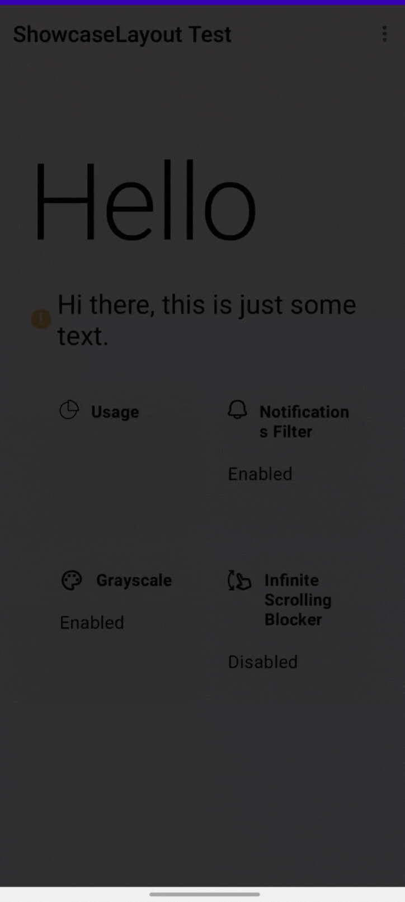
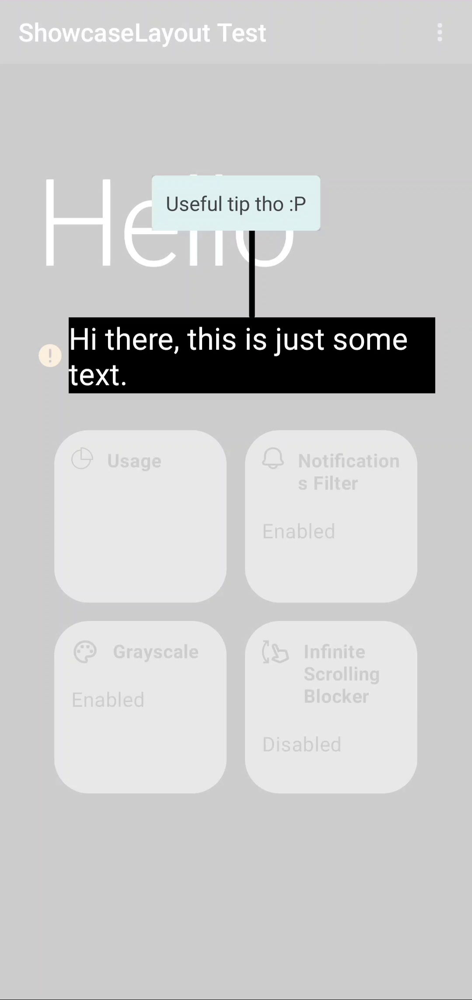
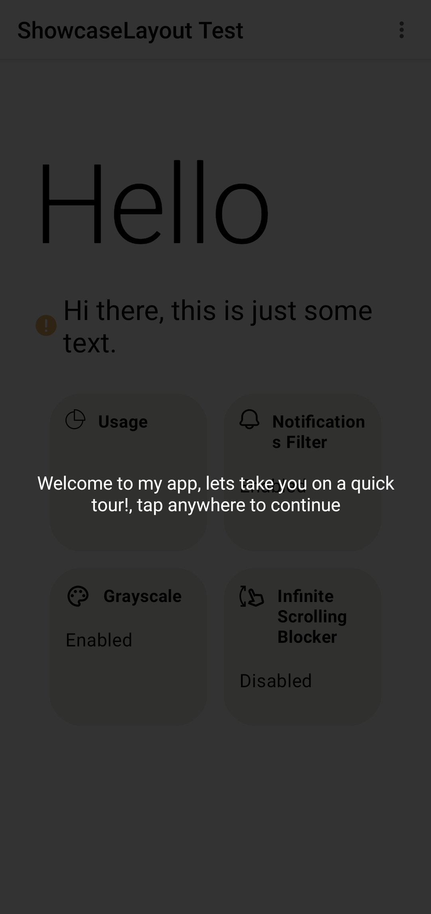
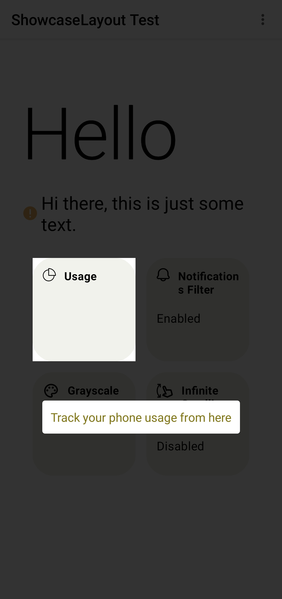
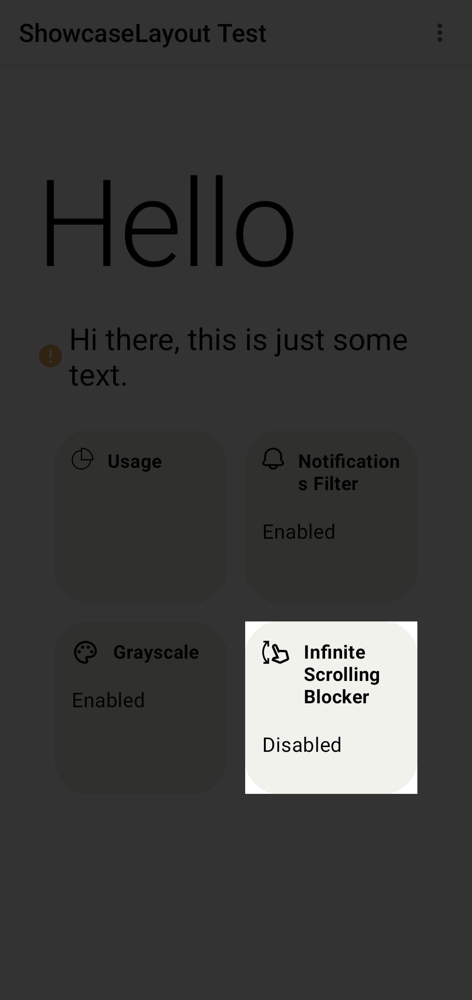
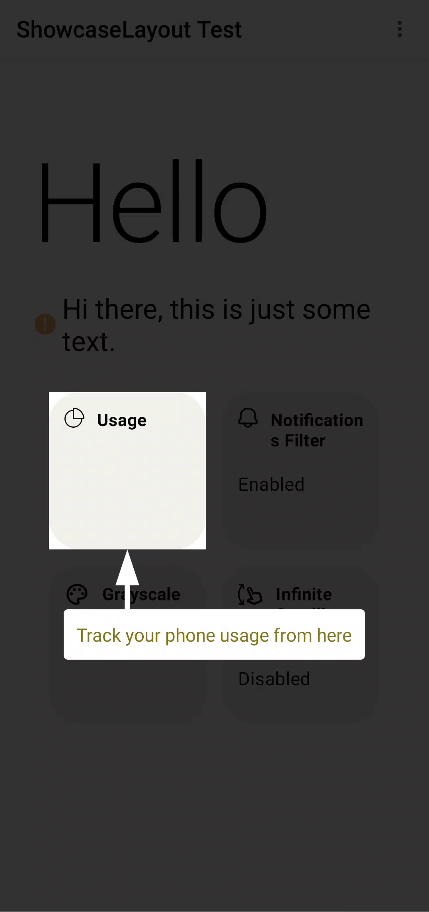
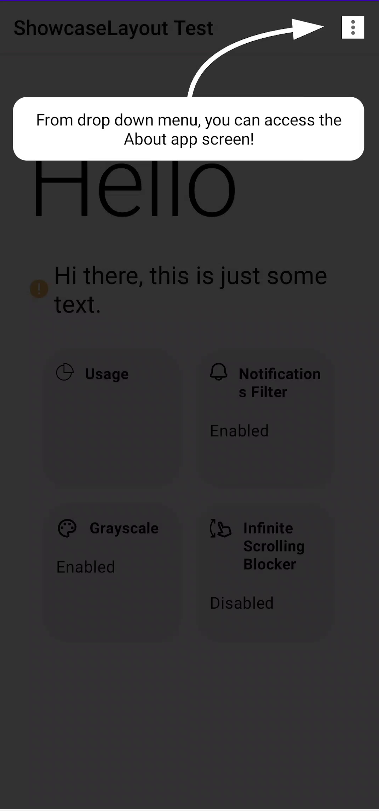
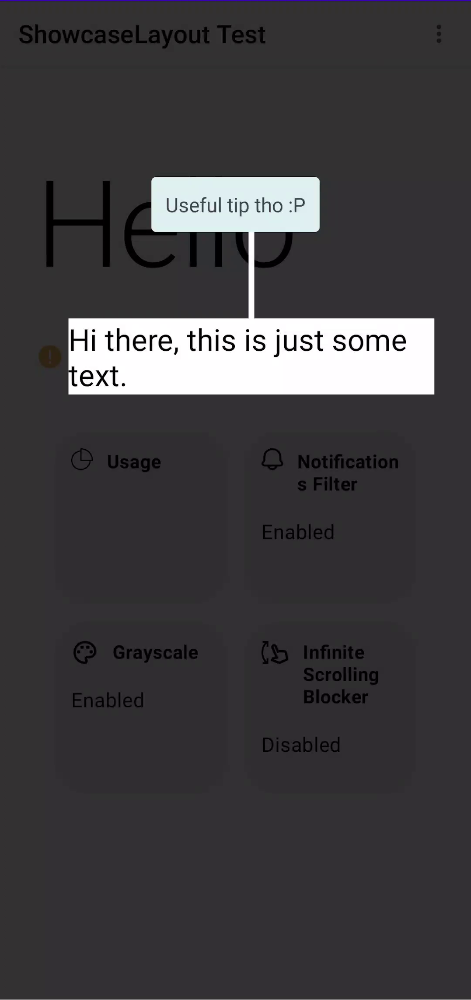

[](https://github.com/tahaak67/ShowcaseLayoutCompose/issues)
[](https://github.com/tahaak67/ShowcaseLayoutCompose/stargazers)
[](https://github.com/tahaak67/ShowcaseLayoutCompose/blob/main/LICENSE)

# Showcase Layout Compose

Create a beautiful animated showcase effect for you android app easily !

## Demo



## Usage

Showcase Layout Compose is available on `mavencentral()`.

Add the dependency to your module's `build.gradle` file like below

```
implementation("ly.com.tahaben:showcase-layout-compose:1.0.3")
```

#### Step 1

Create a ShowcaseLayout and make it the root composable (put all screen composables inside it)

```kotlin
    var isShowcasing by remember {
    mutableStateOf(true)
}
ShowcaseLayout(
    isShowcasing = isShowcasing,
    onFinish = { isShowcasing = false }
) {
    // screen content here
    Column(
        modifier = Modifier
            .fillMaxSize()
    ) {
        Text(text = "ShowcaseLayout Test 1")
        Spacer(modifier = Modifier.height(16.dp))
        Text(text = "ShowcaseLayout Test 2")
        Spacer(modifier = Modifier.height(16.dp))
        Text(text = "ShowcaseLayout Test 3")
    }
}
```

#### Step 2

In composables you want to showcase on the modifier use `Modifier.showcase()`, Lets say we want to
showcase the first
text "ShowcaseLayout Test 1"

```kotlin

Text(
    modifier = Modifier.showcase(
        // should start with 1 and increment with 1 for each new composable you wrap with Showcase()
        k = 1,
        message =
    ),
    text = "ShowcaseLayout Test 1"
)

```

you also use the old method by wrap the composables you want to showcase with `Showcase()`

#### Step 3

Start showcasing by making `isShowcasing = true`, and stop showcasing by making it false \
above we stop showcasing after we showcase the last item using `onFinished` which is called whenever
all items are showcased,

Done, our text is now showcased!, customize it further with Additional parameters

#### Additional parameters

#### isDarkLayout

Makes the showcase view white instead of black (useful for dark UI).

```kotlin
ShowcaseLayout(
    isShowcasing = isShowcasing,
    onFinish = { isShowcasing = false },
    isDarkLayout = isSystemInDarkTheme()
)
```

<p align="center">
isDarkLayout = true <br/>
     
</p>

#### greeting

A customizable greeting message of type `showcaseMsg()`

```kotlin

ShowcaseLayout(
    isShowcasing = isShowcasing,
    onFinish = { isShowcasing = false },
    isDarkLayout = isSystemInDarkTheme(),
    greeting = ShowcaseMsg(
        "Welcome to my app, lets take you on a quick tour!, tap anywhere to continue",
        textStyle = TextStyle(color = Color.White)
    )
)

```

<p align="center">
 
 </p>

#### initKey

the initial value of the counter, set this to 1 if you don't want a greeting message before
showcasing targets.

#### animationDuration

total animation time taken when switching from current to next target in milliseconds(default is
1000ms).

```kotlin
    ShowcaseLayout(
    isShowcasing = isShowcasing,
    onFinish = { isShowcasing = false },
    isDarkLayout = isSystemInDarkTheme(),
    greeting = ShowcaseMsg("Welcome to my app, lets take you on a quick tour!, press anywhere to continue"),
    animationDuration = 1000
) 
```

#### ShowcaseMsg

Use `ShowcaseMsg()` to add a message and customize it with arrow, background and more.

```kotlin
ShowcaseMsg(
    // the message text to be displayed
    "Track your phone usage from here",
    // text style for the message text
    textStyle = TextStyle(color = Color(0xFF827717)),
    // a background color for the text
    msgBackground = MaterialTheme.colors.primary,
    // control corner radius of msgBackground
    roundedCorner = 15.dp,
    // determine if the message will be displayed above or below the target composable
    gravity = Gravity.Bottom,
    // adds an arrow to be displayed with the message
    arrow = Arrow(color = MaterialTheme.colors.primary),
    // starting from version 1.0.3 ShowcaseMsg will have an enter and exit animation of FadeInOut by default you can disable it by using MsgAnimation.None
    enterAnim = MsgAnimation.FadeInOut(),
    exitAnim = MsgAnimation.FadeInOut()
)
```

<p align="center">

| ShowcaseMsg | without ShowcaseMsg |
| :---------------: | :---------------: |
|||

</p>

#### Arrow

Used with ShowcaseMsg to add an arrow pointing to the target

```kotlin
arrow = Arrow(
    // From where the arrow will point at the target, can be: Top, Bottom, Right or Left
    targetFrom = Side.Top,
    // animates a curved arrow from the message to the target(if true targetFrom is ignored)
    // might not work properly depending on the location of the target on the screen
    curved = true,
    // if false then just draw a line (an arrow without head :P)
    hasHead = false,
    // color of the arrow
    color = MaterialTheme.colors.primary
)
``` 

| Default Arrow | `curved = true` | `hasHead = false` |
| :---------------: | :---------------: | :---------------: |
| | | |

## Complete Example

For a complete example check
out [MainScreen.kt](https://github.com/tahaak67/ShowcaseLayoutCompose/blob/main/app/src/main/java/ly/com/tahaben/showcaselayoutcompose/ui/MainScreen.kt) \
or clone/download this repository and check the app module.

## Contributing

Contributions are always welcome!

## Used By

Showcase Layout is used by:

- [Farhan](https://github.com/tahaak67/Farhan)

Contact me if you used ShowcaseLayout in your app and you want it added to this list
