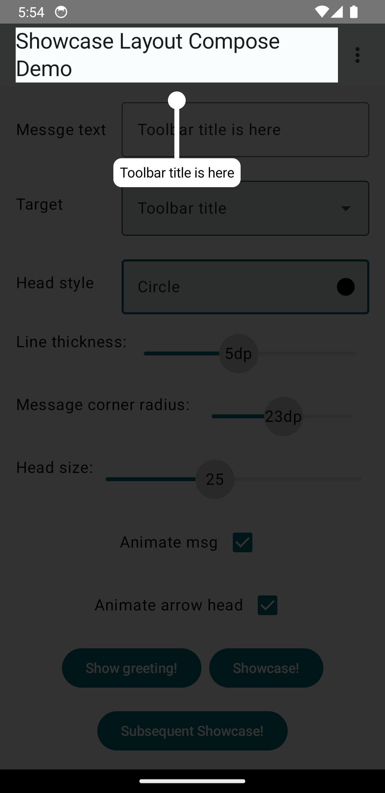
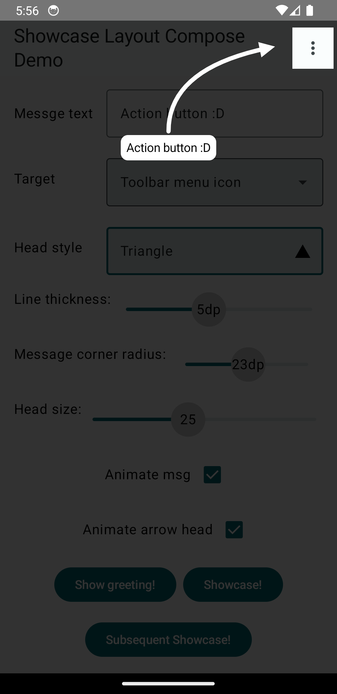
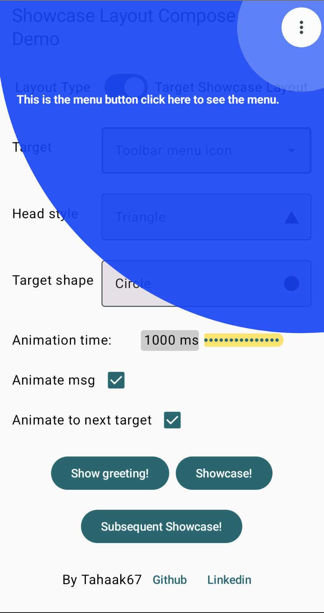
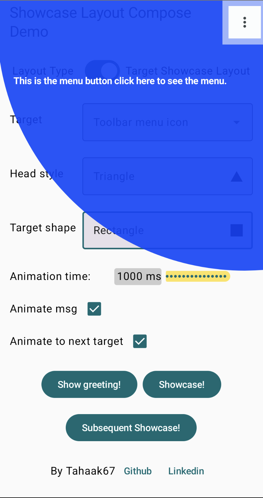
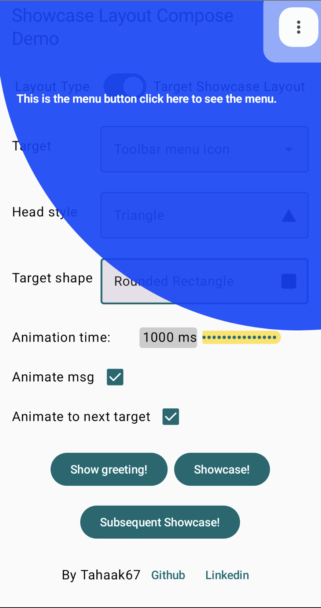
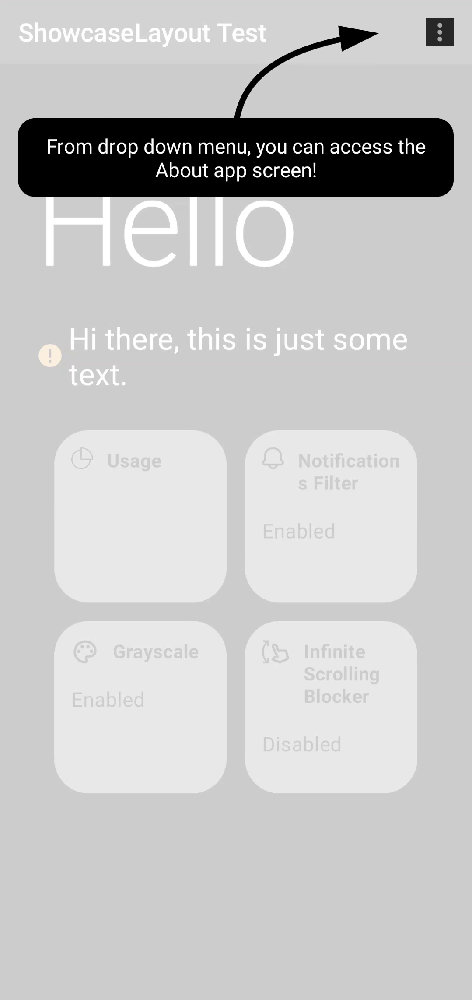
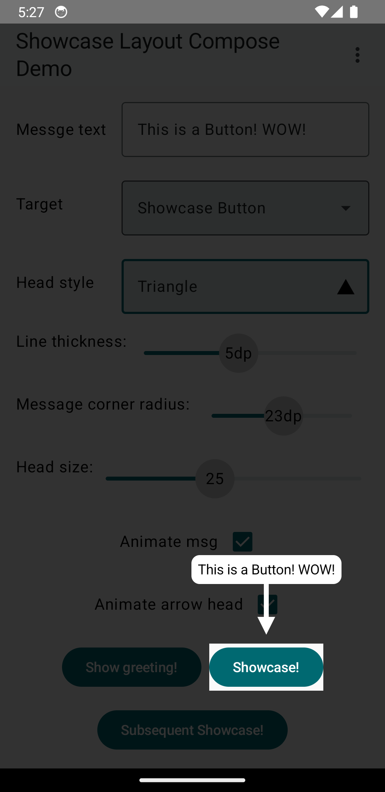
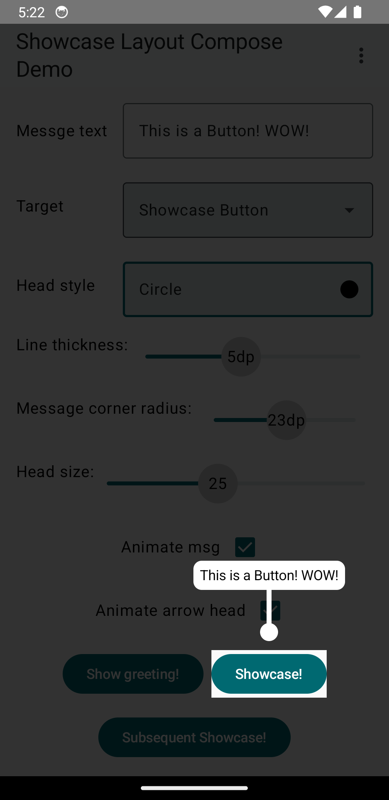
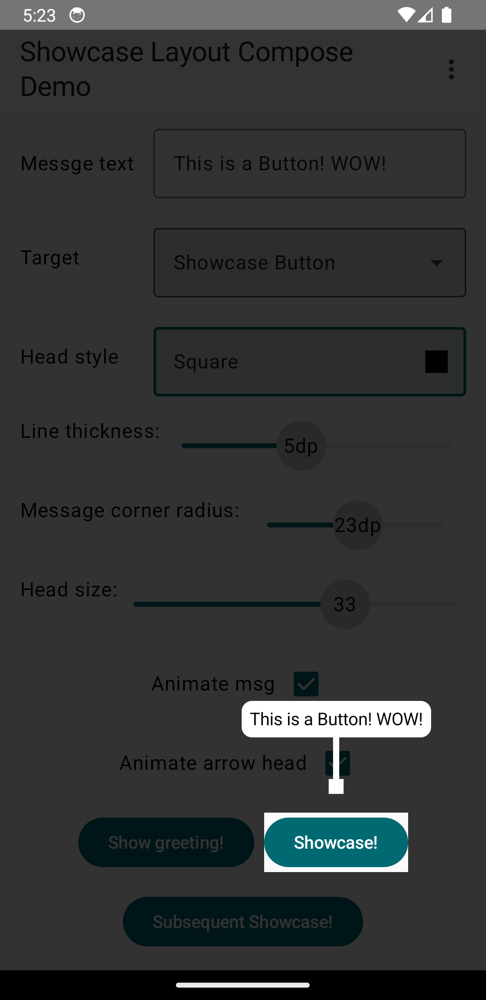
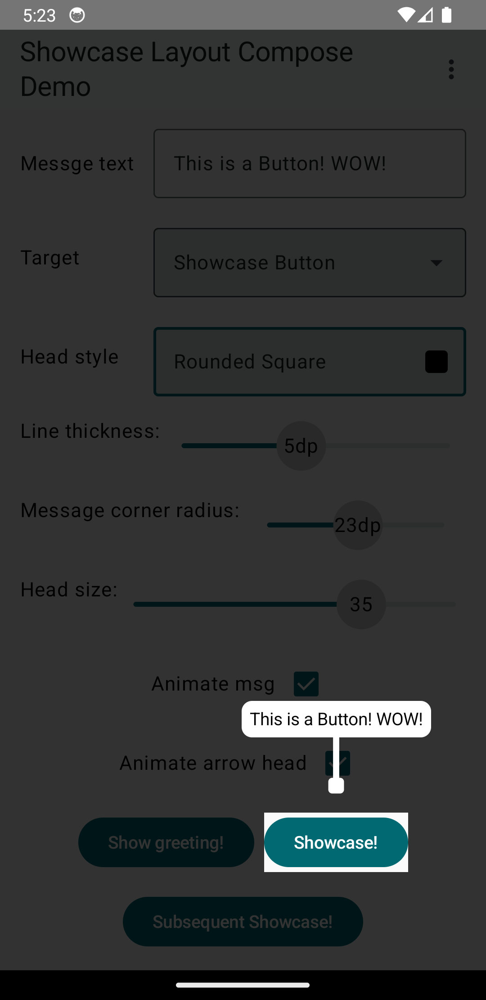

[](https://github.com/tahaak67/ShowcaseLayoutCompose/issues)
[](https://github.com/tahaak67/ShowcaseLayoutCompose/stargazers)
[](https://github.com/tahaak67/ShowcaseLayoutCompose/blob/main/LICENSE)
[](https://github.com/JetBrains/compose-multiplatform)


# Showcase Layout Compose

Create beautiful animated showcase effects for your compose UIs easily!

**Now with multiplatform support and two different showcase layouts to choose from:**
- **ShowcaseLayout**: Classic full-screen overlay with cutouts
- **TargetShowcaseLayout**: Modern targeted highlighting with customizable shapes

## Web demo
[Click here](https://tahaak67.github.io/ShowcaseLayoutCompose/index.html) to try showcase layout for web in your browser!

## Demo

|                               ShowcaseLayout                                |
|:---------------------------------------------------------------------------:|
|  |


.

## Setup

Showcase Layout Compose can be used in **both** Jetpack Compose (native Android) or Compose Multiplatform (Kotlin Multiplatform) projects.


> Compose multiplatform support starts at version `1.0.5-alpha-8` and up.

Add the dependency to your module's `build.gradle` file like below

``` kotlin
implementation("ly.com.tahaben:showcase-layout-compose:1.0.6")
```
## Usage

#### Step 1

Create a ShowcaseLayout and make it the root composable (put all screen composables inside it)

```kotlin
    var isShowcasing by remember {
    mutableStateOf(true)
}
ShowcaseLayout(
    isShowcasing = isShowcasing,
    onFinish = { isShowcasing = false }
) {
    // screen content here
    Column(
        modifier = Modifier
            .fillMaxSize()
    ) {
        Text(text = "ShowcaseLayout Test 1")
        Spacer(modifier = Modifier.height(16.dp))
        Text(text = "ShowcaseLayout Test 2")
        Spacer(modifier = Modifier.height(16.dp))
        Text(text = "ShowcaseLayout Test 3")
    }
}
```

#### Step 2

In composables you want to showcase on the modifier use `Modifier.showcase()`, Lets say we want to
showcase the first
text "ShowcaseLayout Test 1"

```kotlin

Text(
    modifier = Modifier.showcase(
        // should start with 1 and increment with 1 for each time you use Modifier.showcase()
        index = 1,
        message = ShowcaseMsg(
            "This is a showcase message",
            textStyle = TextStyle(color = Color.White)
        )
    ),
    text = "ShowcaseLayout Test 1"
)

```

you also use the old method by wrap the composables you want to showcase with `Showcase()`

#### Step 3

You have 2 ways of showcasing, showcase everything subsequently or showcasing each item manually  
<details>

<summary> <b> Showcase all items subsequently</b>  </summary>
Start showcasing by making <code>isShowcasing = true</code>, and stop showcasing by making it false 
above we stop showcasing after we showcase the last item using `onFinished` which is called whenever
all items are showcased,
</details>

<details>

<summary> <b>Showcase a single item (1.0.5 and up)</b> </summary>
After you attach the index and showcase message to your components you can simply call <code>showcaseItem(i)</code> where i is the index of the item you want to showcase

```kotlin
    val coroutineScope = rememberCoroutineScope()

    coroutineScope.launch{
        showcaseItem(1)
    }
```
similarly you can show a greeting using <code>showGreeting</code> and passing the message

```kotlin
    val coroutineScope = rememberCoroutineScope()

    coroutineScope.launch{
        showGreeting(
            ShowcaseMsg(
            text = "I like compose bro <3",
            textStyle = TextStyle(color = Color.White)
            )
        )
    }
```
</details>


Done, our text is now showcased!, customize it further with Additional parameters.

## TargetShowcaseLayout (New!)

Starting from version 1.0.6, Showcase Layout Compose now offers a new layout option: `TargetShowcaseLayout`. This layout provides a different visual approach to showcasing UI elements by highlighting specific targets with customizable shapes rather than the full-screen approach of the original ShowcaseLayout.

### Key Features

- Highlights target elements with customizable shapes (circle, rectangle, or rounded rectangle)
- Smooth animations between targets
- Pulsing effect around the target for better visibility
- All the same customization options as the original ShowcaseLayout

### Usage

You can use TargetShowcaseLayout directly:

```kotlin
var isShowcasing by remember { mutableStateOf(true) }

TargetShowcaseLayout(
    isShowcasing = isShowcasing,
    onFinish = { isShowcasing = false },
    targetShape = TargetShape.ROUNDED_RECTANGLE, // CIRCLE, RECTANGLE, or ROUNDED_RECTANGLE
    cornerRadius = 8.dp, // Only used with ROUNDED_RECTANGLE
    animateToNextTarget = true, // Smooth animation between targets
    greeting = ShowcaseMsg(
        "Welcome to TargetShowcaseLayout!",
        textStyle = TextStyle(color = Color.White)
    )
) {
    // Your UI content here
    Column {
        Text(
            modifier = Modifier.showcase(
                index = 1,
                message = ShowcaseMsg(
                    "This element is highlighted with TargetShowcaseLayout",
                    textStyle = TextStyle(color = Color.White)
                )
            ),
            text = "Target Showcase Example"
        )
    }
}
```

|                              TargetShowcaseLayout with CIRCLE shape                              |                          TargetShowcaseLayout with RECTANGLE shape                           |                           TargetShowcaseLayout with ROUNDED_RECTANGLE shape                            |
|:------------------------------------------------------------------------------------------------:|:--------------------------------------------------------------------------------------------:|:------------------------------------------------------------------------------------------------------:|
|  |  |  |

### TargetShowcaseLayout vs ShowcaseLayout

| Feature | TargetShowcaseLayout | ShowcaseLayout |
|---------|---------------------|----------------|
| Visual style | Highlights specific targets with shapes | Full-screen overlay with cutouts |
| Target shapes | Circle, Rectangle, Rounded Rectangle | Circle, Rectangle, Rounded Rectangle |
| Animations | Smooth transitions between targets | Fade transitions |
| Pulsing effect | Yes | No |
| Use cases | Focused UI tours, precise element highlighting | General app tours, feature introductions |

### TargetShowcaseLayout Parameters

In addition to the parameters shared with ShowcaseLayout, TargetShowcaseLayout offers:

```kotlin
TargetShowcaseLayout(
    // Common parameters (same as ShowcaseLayout)
    isShowcasing = isShowcasing,
    isDarkLayout = false,
    initIndex = 0,
    animationDuration = 1000,
    onFinish = { isShowcasing = false },
    greeting = ShowcaseMsg(
        "Welcome to TargetShowcaseLayout!",
        textStyle = TextStyle(color = Color.White)
    ),
    lineThickness = 5.dp,

    // TargetShowcaseLayout specific parameters
    targetShape = TargetShape.CIRCLE, // CIRCLE, RECTANGLE, or ROUNDED_RECTANGLE
    cornerRadius = 8.dp, // Only used with ROUNDED_RECTANGLE
    animateToNextTarget = true // Smooth animation between targets, otherwise shrink and expand on each target
) {
    // Your UI content here
}
```


<!-- SCREENSHOT PLACEHOLDER: Add a side-by-side comparison of the same UI with both layouts -->

#### Additional parameters

#### isDarkLayout

Makes the showcase view white instead of black (useful for dark UI).

```kotlin
ShowcaseLayout(
    isShowcasing = isShowcasing,
    onFinish = { isShowcasing = false },
    isDarkLayout = isSystemInDarkTheme()
)
```

<p align="center">
isDarkLayout = true <br/>
     
</p>

#### greeting

A customizable greeting message of type `showcaseMsg()`

```kotlin

ShowcaseLayout(
    isShowcasing = isShowcasing,
    onFinish = { isShowcasing = false },
    isDarkLayout = isSystemInDarkTheme(),
    greeting = ShowcaseMsg(
        "Welcome to my app, lets take you on a quick tour!, tap anywhere to continue",
        textStyle = TextStyle(color = Color.White)
    )
)

```

<p align="center">
 
 </p>

#### initIndex

the initial value of the counter, set this to 1 if you don't want a greeting message before
showcasing targets.

#### animationDuration

total animation time taken when switching from current to next target in milliseconds(default is
1000ms).

```kotlin
    val greetingString = buildAnnotatedString {
    append("Welcome to ")
    pushStyle(SpanStyle(fontWeight = FontWeight.Bold))
    append("My App")
    pop()
    append(", let's take you on a quick tour!")
    pushStyle(SpanStyle(fontWeight = FontWeight.Bold))
    append("\n Tap anywhere")
    pop()
    append(" to continue")
}
ShowcaseLayout(
    isShowcasing = isShowcasing,
    onFinish = { isShowcasing = false },
    isDarkLayout = isSystemInDarkTheme(),
    greeting = ShowcaseMsg(
        text = greetingString, // You can use an annotated string or a normal string here
        textStyle = TextStyle(color = Color.White, textAlign = TextAlign.Center)
    ),
    animationDuration = 1000
) 
```

#### ShowcaseMsg

Use `ShowcaseMsg()` to add a message and customize it with arrow, background and more.

```kotlin
ShowcaseMsg(
    // the message text to be displayed
    "Track your phone usage from here",
    // text style for the message text
    textStyle = TextStyle(color = Color(0xFF827717)),
    // a background color for the text
    msgBackground = MaterialTheme.colors.primary,
    // control corner radius of msgBackground
    roundedCorner = 15.dp,
    // determine if the message will be displayed above or below the target composable
    gravity = Gravity.Bottom,
    // adds an arrow to be displayed with the message
    arrow = Arrow(color = MaterialTheme.colors.primary),
    // starting from version 1.0.3 ShowcaseMsg will have an enter and exit animation of FadeInOut by default you can disable it by using MsgAnimation.None
    enterAnim = MsgAnimation.FadeInOut(),
    exitAnim = MsgAnimation.FadeInOut()
)
```

<p align="center">

| ShowcaseMsg | without ShowcaseMsg |
| :---------------: | :---------------: |
|||

</p>

#### Arrow

Used with ShowcaseMsg to add an arrow pointing to the target

```kotlin
arrow = Arrow(
    // From where the arrow will point at the target, can be: Top, Bottom, Right or Left
    targetFrom = Side.Top,
    // animates a curved arrow from the message to the target(if true targetFrom is ignored)
    // might not work properly depending on the location of the target on the screen
    curved = true,
    // if false then just draw a line (an arrow without head :P)
    hasHead = false,
    // color of the arrow
    color = MaterialTheme.colors.primary
)
``` 

|                                          Default Arrow                                           |                                         `curved = true`                                          |                                        `hasHead = false`                                         |
|:------------------------------------------------------------------------------------------------:|:------------------------------------------------------------------------------------------------:|:------------------------------------------------------------------------------------------------:|
|  |  |  |

#### Head style
By default, an Arrow will have a triangle as the head to change this, set `head` in the arrow to one of these options

|                                                 `TRIANGLE`                                                 |                                                `CIRCLE`                                                 |                                                 `SQUARE`                                                 |                                                 `ROUND_SQUARE`                                                 |
|:----------------------------------------------------------------------------------------------------------:|:-------------------------------------------------------------------------------------------------------:|:--------------------------------------------------------------------------------------------------------:|:--------------------------------------------------------------------------------------------------------------:|
|  |  |  |  |

You can also animate the arrow head and change the size, see the example below.
```kotlin
showcase(
    index = 5, 
    message = ShowcaseMsg(
        "A Circle !",
        textStyle = TextStyle(
            color = Color(0xFF827717),
            fontSize = 18.sp
        ),
        msgBackground = MaterialTheme.colors.primary,
        gravity = Gravity.Top,
        arrow = Arrow(
            color = MaterialTheme.colors.primary,
            targetFrom = Side.Top,
            head = Head.CIRCLE, // head style
            headSize = 30f, // the size of the circle
            animSize = true // animates the arrow head size
        )
    )
)
```

## Logging Events
In recent releases logs have been disabled by default, to print log statement of the current actions taken by compose layout register a listener in your ShowcaseLayout
```kotlin
        registerEventListener(object: ShowcaseEventListener {
            override fun onEvent(level: Level, event: String) {
                println("$level: $event")
            }
        })
```


## Complete Examples

### ShowcaseLayout Example
For a complete example of the original ShowcaseLayout, check out [MainScreen.kt](https://github.com/tahaak67/ShowcaseLayoutCompose/blob/main/app/src/main/java/ly/com/tahaben/showcaselayoutcompose/ui/MainScreen.kt).

### TargetShowcaseLayout Example
For an example of the new TargetShowcaseLayout, check out the [App.kt](https://github.com/tahaak67/ShowcaseLayoutCompose/blob/main/composeApp/src/commonMain/kotlin/App.kt) file in the composeApp module.

You can also clone/download this repository and run the demo app to see both layouts in action.


| Comparison of both layouts |
|:-------:|
| [Add your comparison screenshot path here] |

## Contributing

Contributions are always welcome!

## Used By

Showcase Layout is used by:

- [Farhan](https://github.com/tahaak67/Farhan)

Contact me on LinkedIn or open an issue if you used ShowcaseLayout in your app, and you want it added to this list
